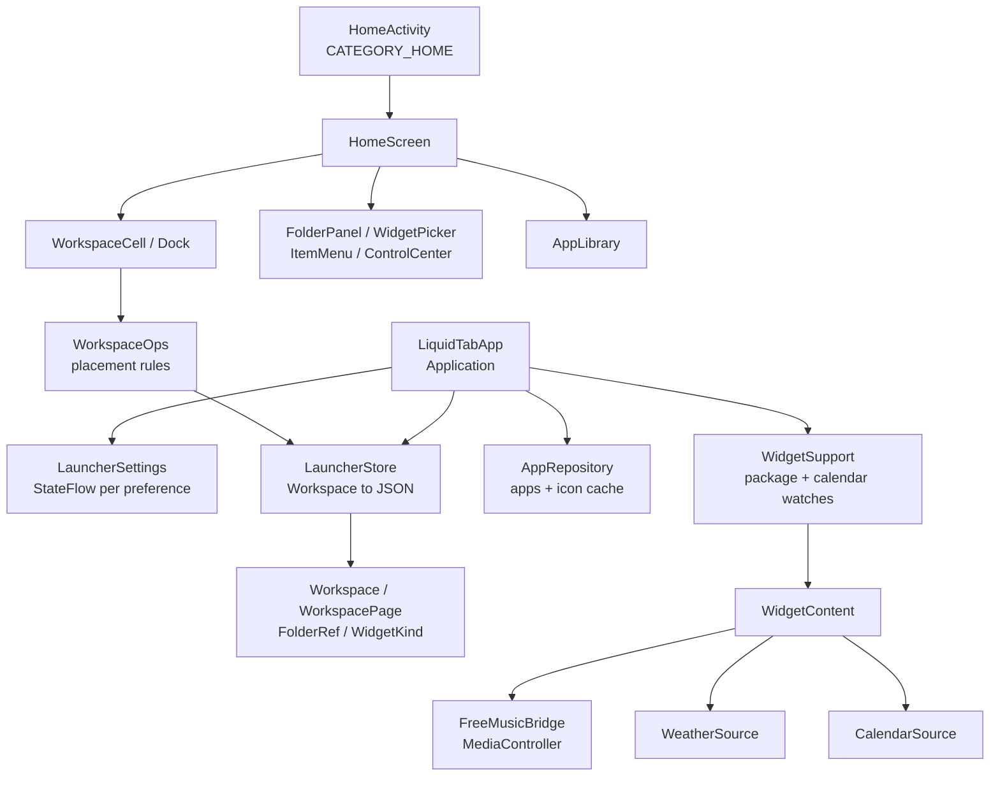

# Liquid Tab Launcher

An Android tablet Home app built from the FreeMusic design system: a page-based
workspace of apps, folders and widgets, drawn on Liquid Glass surfaces over a
layered background.

It is a launcher, not a player. FreeMusic stays the single music app — this
launcher surfaces it through a Now Playing widget and a media session client,
and never opens a second player of its own.



## Build

`JAVA_HOME` must point at a JDK 17 or newer; the project does not read a system
Java.

```powershell
$env:JAVA_HOME = "C:\Users\<you>\.gradle\jdks\eclipse_adoptium-21-amd64-windows.2"
.\gradlew.bat :app:assembleDebug        # app\build\outputs\apk\debug\app-debug.apk
.\gradlew.bat :app:testDebugUnitTest    # placement rules under test
```

Install and set as Home:

```powershell
adb install -r app\build\outputs\apk\debug\app-debug.apk
adb shell cmd package set-home-activity com.ihimanshunayak.liquidtab.debug/com.ihimanshunayak.liquidtab.HomeActivity
```

The debug build installs under `com.ihimanshunayak.liquidtab.debug`, so it never
replaces a release install.

## Layout

| Module | What lives there |
|---|---|
| `app` | Every launcher feature: Home, library, widgets, controls, settings |
| `core-ui` | The FreeMusic design system — theme, type scale, Liquid Glass, the vendored backdrop engine, haptics |

Inside `app`:

| Package | Responsibility |
|---|---|
| `data` | The model and its rules. `WorkspaceOps` is the only place placement is decided; `LauncherStore` is the only writer to disk |
| `ui.home` | Pages, dock, drag, folders, wallpaper, long-press menu |
| `ui.widgets` | The eight widget renderers and their shared plates |
| `ui.library` | App drawer and search |
| `ui.controls` | Control Center and the tiles that back it |
| `media` | The FreeMusic session client |
| `settings` | The preference screen |
| `util` | Launch helpers that survive a missing app |

## Features

**Workspace.** Multiple pages with a dock, drag-and-drop reordering across pages
and into the dock, and folders that hold apps and dissolve themselves below two
members. Placement rules live in `WorkspaceOps` as pure functions, which is why
they are covered by unit tests rather than by hand on a device.

**Widgets.** Clock, date, weather, calendar, battery, FreeMusic player,
favourites and quick actions. Added and removed through an in-Home picker.
Every widget reads a live source: weather refreshes on a 30-minute loop and
keeps its last reading marked stale rather than blanking, calendar observes the
provider, the player talks to FreeMusic's `MediaSession`, and quick actions
drive the real system toggles.

**FreeMusic integration.** `FreeMusicBridge` is a reference-counted singleton
over a Media3 `MediaController`. A Home screen with no player widget never opens
a service connection, and the bridge is read-only apart from transport control —
playlists and playback state belong to FreeMusic.

**Control Center.** Wi-Fi, Bluetooth, do-not-disturb, torch, rotation lock,
ringer mode and brightness. Each tile degrades to opening the system panel when
the launcher lacks the privilege to toggle it directly.

**Gestures.** A swipe down from anywhere opens Control Center; a swipe up from
the bottom edge opens the app library. Only those two are claimed, so Android's
own navigation gestures keep working.

**Settings.** Only preferences the launcher actually honours are shown — a row
that cannot change behaviour is not offered. `SettingsScreen` reads the same
`StateFlow`s the launcher reads, so the screen cannot drift from the Home screen.

## Design decisions worth knowing

**Nothing is guessed.** A shortcut whose app has gone is removed the moment a
launch fails, not left as a dead icon until the next package broadcast. A
workspace payload written by a newer build is copied aside under
`workspace_json_bad` rather than being interpreted.

**A low-memory kill must not lose a layout.** `LauncherStore` debounces writes
during a drag, so `LiquidTabApp` forces a flush on `onTrimMemory` and
`onLowMemory` — and `AppRepository.trim()` shrinks the icon cache to a floor
instead of clearing it, because throwing every icon away under memory pressure
would make the next frame the most expensive one.

**The last page is never removed.** Pruning an emptied page keeps
`pages.lastIndex`, because an empty trailing page is a canvas the user still
has.

**Widgets never draw a zero.** Every widget state is one of idle, loading, ready
(with a stale flag) or unavailable with a reason, so a widget says what it is
waiting for rather than showing placeholder text.

## Requirements

`minSdk 26`, `targetSdk 36`, `compileSdk 37`. Real-time backdrop blur needs
Android 12 (`RenderEffect`); below that the glass falls back to a translucent
scrim and the settings screen says so.

## Testing

`app/src/test/.../WorkspaceOpsTest.kt` covers the placement rules — folder
dissolution, dock membership, spill-on-delete, pruning, drop resolution and
first-run seeding. These are the rules that are cheap to get subtly wrong and
expensive to notice late, so they are checked without a device.

```powershell
.\gradlew.bat :app:testDebugUnitTest
```
