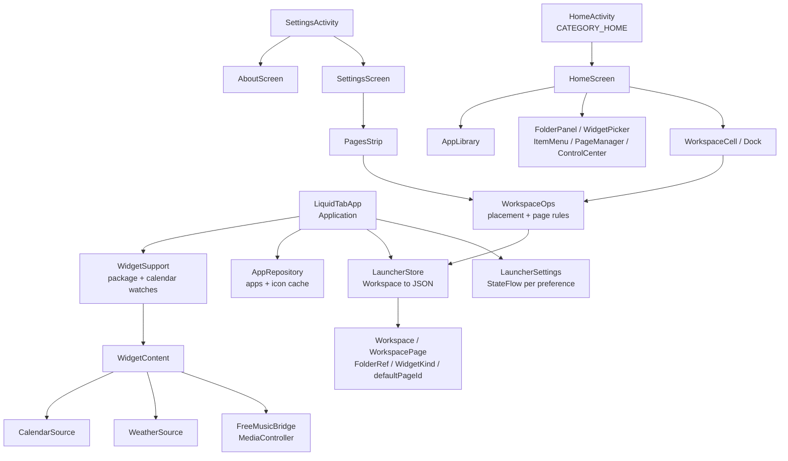

# Liquid Tab Launcher

An Android tablet Home app built from the FreeMusic design system: a page-based
workspace of apps, folders and widgets, drawn on Liquid Glass surfaces over a
layered background.

It is a launcher, not a player. FreeMusic stays the single music app — this
launcher surfaces it through a Now Playing widget and a media session client,
and never opens a second player of its own.



## Build

`JAVA_HOME` must point at a JDK 17 or newer; the project does not read a system
Java.

```powershell
$env:JAVA_HOME = "C:\Users\<you>\.gradle\jdks\eclipse_adoptium-21-amd64-windows.2"
.\gradlew.bat :app:assembleDebug        # app\build\outputs\apk\debug\app-debug.apk
.\gradlew.bat :app:testDebugUnitTest    # placement + page rules under test
```

Install and set as Home:

```powershell
adb install -r app\build\outputs\apk\debug\app-debug.apk
adb shell cmd package set-home-activity com.ihimanshunayak.liquidtab.debug/com.ihimanshunayak.liquidtab.HomeActivity
```

The debug build installs under `com.ihimanshunayak.liquidtab.debug`, so it never
replaces a release install.

## Layout

| Module | What lives there |
|---|---|
| `app` | Every launcher feature: Home, library, widgets, controls, settings |
| `core-ui` | The FreeMusic design system — theme, type scale, Liquid Glass, the vendored backdrop engine, haptics |

Inside `app`:

| Package | Responsibility |
|---|---|
| `data` | The model and its rules. `WorkspaceOps` is the only place placement and page edits are decided; `LauncherStore` is the only writer to disk |
| `ui.home` | Pages, dock, drag, folders, wallpaper, long-press menu, page manager |
| `ui.widgets` | The eight widget renderers and their shared plates |
| `ui.library` | App drawer and search |
| `ui.controls` | Control Center and the tiles that back it |
| `media` | The FreeMusic session client |
| `settings` | The settings screen, the About screen, and the row chrome they share |
| `util` | Launch helpers that survive a missing app, and the default-Home role helpers |

## Features

**Workspace.** Multiple pages with a dock, drag-and-drop reordering across pages
and into the dock, and folders that hold apps and dissolve themselves below two
members. Placement rules live in `WorkspaceOps` as pure functions, which is why
they are covered by unit tests rather than by hand on a device.

**Pages.** Pages are objects, not just somewhere the finger happens to be. A long
press on empty Home space opens the page manager: a card per page showing a
miniature of the real grid, arrows to reorder, a delete that spills the page's
shortcuts onto its neighbour rather than destroying them, and a pin for the page
a Home press returns to. The page indicator's dots are tappable, and a Home press
while the launcher is already open travels back to the nominated page — which is
how every other launcher behaves and what a Home press is for.

**About.** Reachable from Settings: the exact build (`versionName`,
`versionCode`, and the date the build ran), the device it is on, whether this app
currently holds the Home role with a button that opens Android's own Home-app
chooser, and the software notices for the code inside it — the vendored backdrop
engine's Apache-2.0 notice included, read on the device rather than paraphrased.

**Widgets.** Clock, date, weather, calendar, battery, FreeMusic player,
favourites and quick actions. Added and removed through an in-Home picker.
Every widget reads a live source: weather refreshes on a 30-minute loop and
keeps its last reading marked stale rather than blanking, calendar observes the
provider, the player talks to FreeMusic's `MediaSession`, and quick actions
drive the real system toggles.

**FreeMusic integration.** `FreeMusicBridge` is a reference-counted singleton
over a Media3 `MediaController`. A Home screen with no player widget never opens
a service connection, and the bridge is read-only apart from transport control —
playlists and playback state belong to FreeMusic.

**Control Center.** Wi-Fi, Bluetooth, do-not-disturb, torch, rotation lock,
ringer mode and brightness. Each tile degrades to opening the system panel when
the launcher lacks the privilege to toggle it directly.

**Gestures.** A swipe down from anywhere opens Control Center; a swipe up from
the bottom edge opens the app library. A long press on empty Home space opens the
page manager — the only three the launcher claims, so Android's own navigation
gestures keep working. Long press on an app, folder or widget is still that
item's own menu, which is why the page manager listens only where nothing else
has claimed the press.

**Settings.** Only preferences the launcher actually honours are shown — a row
that cannot change behaviour is not offered. `SettingsScreen` reads the same
`StateFlow`s the launcher reads, so the screen cannot drift from the Home screen.
Home pages are managed here as well as from the Home long press, using the same
`WorkspaceOps` calls and the same page previews.

## Design decisions worth knowing

**Nothing is renamed in a release build.** R8 shrinks and optimizes — Compose
needs it to run at the speed it was written for — but `-dontobfuscate` keeps
every class name, so a stack trace from a user's device is readable without a
mapping file to hand. The AGP defaults do not include this, so it is stated in
`proguard-rules.pro` rather than assumed; the mapping output confirms no class in
this package is renamed.

**Nothing is guessed.** A shortcut whose app has gone is removed the moment a
launch fails, not left as a dead icon until the next package broadcast. A
workspace payload written by a newer build is copied aside under
`workspace_json_bad` rather than being interpreted.

**A low-memory kill must not lose a layout.** `LauncherStore` debounces writes
during a drag, so `LiquidTabApp` forces a flush on `onTrimMemory` and
`onLowMemory` — and `AppRepository.trim()` shrinks the icon cache to a floor
instead of clearing it, because throwing every icon away under memory pressure
would make the next frame the most expensive one.

**Pages are known by id, not by index.** The Home page and every page preview
address pages by id, so reordering a page can never silently move the Home page
to a page the user never chose. A nomination left dangling by a delete is
stripped rather than repaired by guessing.

**A deleted page spills, it does not destroy.** Removing a page hands its
shortcuts to the neighbour — prepended when the removed page was the first one,
so the surviving page keeps the reading order the user had. The last remaining
page is never removed, and a page that arrived empty is a canvas the user still
has: pruning keeps it, and only pages this build emptied itself are dropped.

**A Home press is answered.** When the launcher is already open a Home press
closes whatever is on top — Control Center, the library, search — before it
scrolls the grid back to the nominated page, so one press always unwinds one
layer and the page move only happens on a bare Home screen.

**Widgets never draw a zero.** Every widget state is one of idle, loading, ready
(with a stale flag) or unavailable with a reason, so a widget says what it is
waiting for rather than showing placeholder text.

## Installing a release

Signed APKs are published on the [releases page](https://github.com/ihimanshunayak/LiquidTabLauncher/releases).
Android refuses to update a build signed by a different key, so uninstall any
earlier APK from another source before installing one of these.

Building a release yourself needs the signing key. `keystore.properties` names it
and is gitignored — copy `keystore.properties.example` and create the keystore
once with the `keytool` line in that file. Without it the release build still
runs and produces `app-release-unsigned.apk` rather than failing.

```powershell
.\gradlew.bat :app:assembleRelease
```

## Requirements

`minSdk 26`, `targetSdk 36`, `compileSdk 37`. Real-time backdrop blur needs
Android 12 (`RenderEffect`); below that the glass falls back to a translucent
scrim and the settings screen says so.

## Accessibility

Home icons, library rows and folder tiles each merge into a single
accessibility node with a real name, so a screen reader announces "Maps" once
rather than three times for artwork, label and badge. Settings rows toggle from
the whole row rather than from the switch alone, and the segmented choices are a
radio group. Page indicator dots are separate buttons with their own labels
rather than one wide tap strip, and each page card in the page manager announces
which page it is and whether it is the Home page. Touch targets are held at the
platform minimum: the transport buttons claim a 44 dp box, the quick-action chips
and segment pills enforce a minimum height, and control tiles are 84 dp tall.

## Testing

`app/src/test/.../WorkspaceOpsTest.kt` covers the placement and page rules —
folder dissolution, dock membership, spill-on-delete, pruning, drop resolution,
first-run seeding, and every page operation (append, insert, reorder, delete,
Home-page nomination) including the case where deleting the first page must
prepend the survivors. These are the rules that are cheap to get subtly wrong
and expensive to notice late, so they are checked without a device.
`WorkspaceJsonTest.kt` covers the persisted format — including the Home-page
nomination and the recovery path for a payload this build cannot read.

```powershell
.\gradlew.bat :app:testDebugUnitTest
```
